# Password-Generator
Assignment-3

For this application the code starts with 5 global variables, all with blank strings. These are going to determine the length and characters of the User's password. A prompt function follows the variables start the process of asking the user about their password.
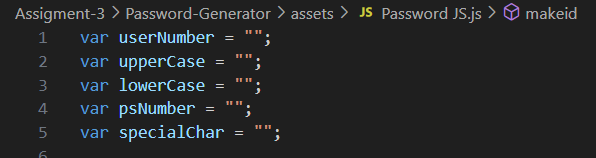

Every prompt is held within While Loops to prevent the user from answering questions with invalid answers. The prompts are all held within another While Loop to prevent users from answering questions in a way to prevent a password from being generated.
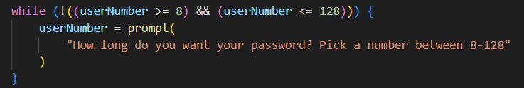
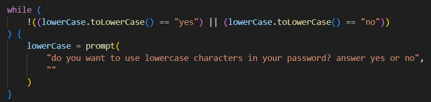
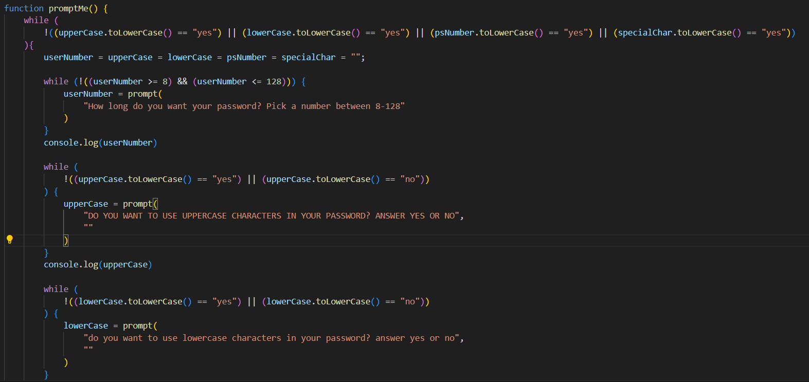

After the Prompt Function is finished, the next few lines of code is display the password on the screen. Style.Wordbreak makes it so that longer passwords won't run off screen.
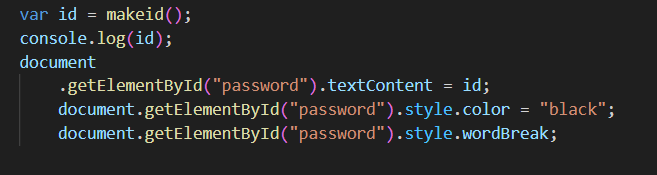

The variable "id" is to hold the Makeid Function, which is the code that generates the User's Passwords. The function uses the User's answers from the prompts to make strings of avalible characters that can be used in the password. 
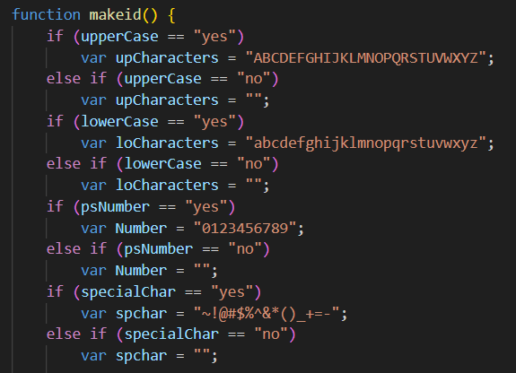

Then the next variable collects the strings of available characters to make one string that is used in a For Loop that uses the User's numer of choice to pick characters randomly until they reach the character number limit. Then the result is assigned as the value to the "id" variable.
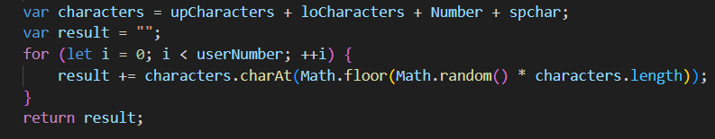

I have console.log for a few different sections of the program, those don't do anything for the program functioning, but was a useful tool for me to keep track of if the program was working properly and keep track of what I was doing.

The page itself is very bare since the focus for this assignment is write working code to generate passwords.
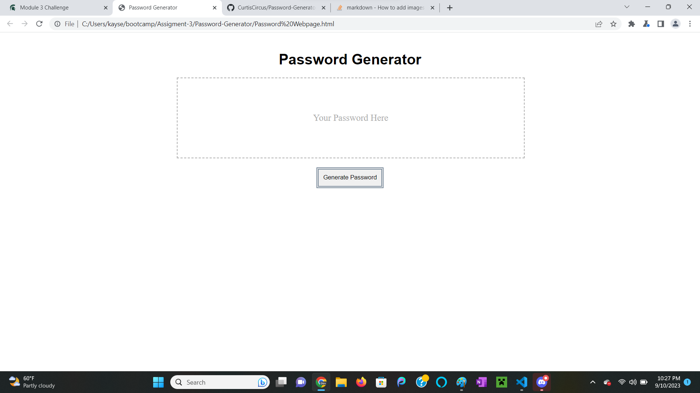

When you click the button that says "generate password" it starts prompting you questions. If you try to answer any of the questions outside of the suggested answers the question will prompt again. If you answer every "yes or no" question with no then the prompts will cycle through again.
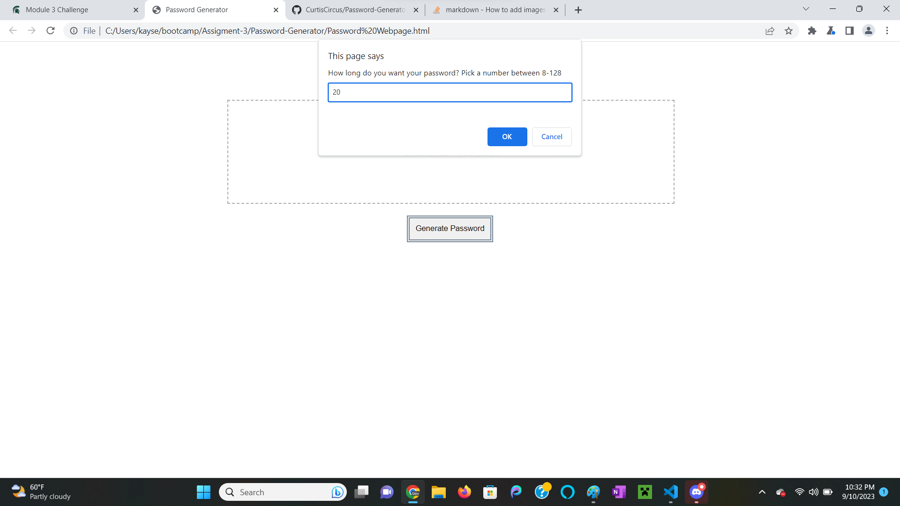
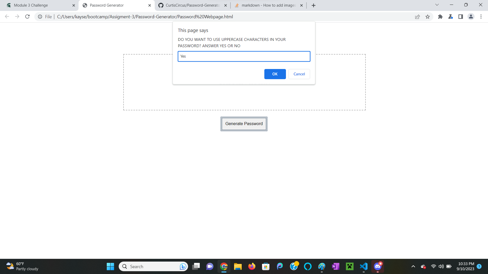
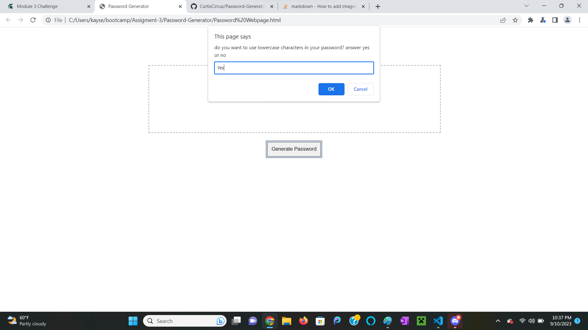
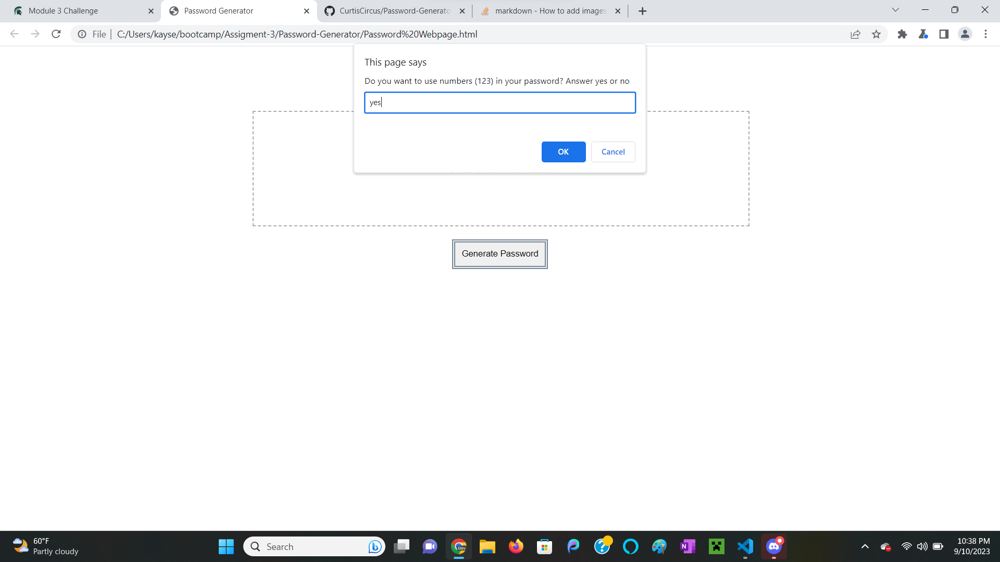

After answering every prompt the password is generated and displayed in the box for the User.